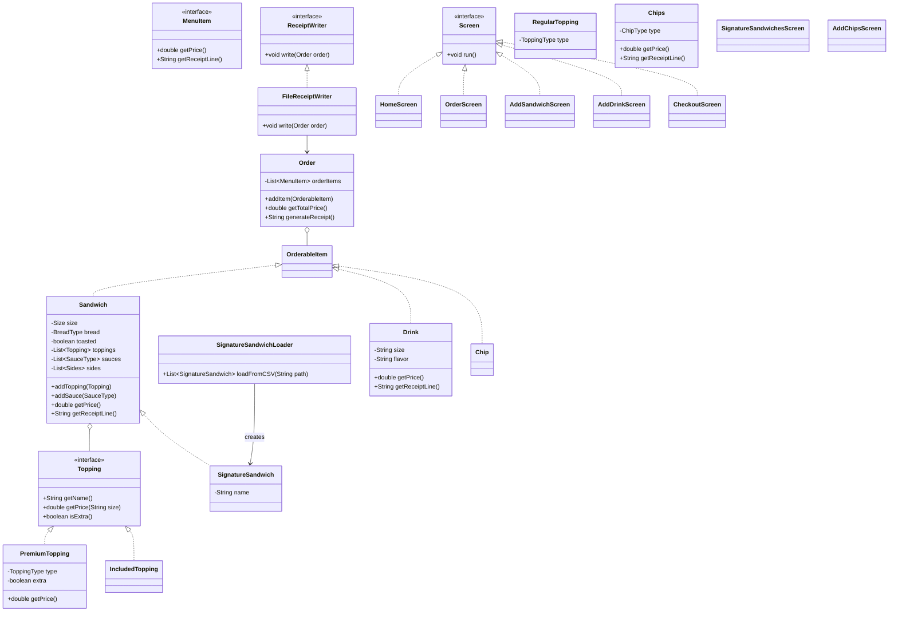

# deli-cious
This project is the point of sales java application for DELI-cious, a custom sandwich shop.

SQL QUERY
SELECT * FROM CITY WHERE POPULATION > 100000 AND COUNTRYCODE = "USA";

FIZZBUZZ
PYTHON
i = 1
for i in range(1, 101):
    if i % 3 == 0 and i % 5 == 0:
        print("FizzBuzz")
    elif i % 3 == 0:
        print("Fizz")
    elif i % 5 == 0:
        print("Buzz")
    else:
        print(i)
JAVA
for(int i = 1; i <= 100; i++){
    if(i % 3 == 0 && i % 5 == 0){
        System.out.println("FizzBuzz");
    } else if (i % 3 == 0){
        System.out.println("Fizz);
    } else if (i % 5 == 0){
        System.out.println("Buzz");
    } else {
        System.out.println(i);
    }
}

ANAGRAM: HASHMAP
by checking that each hashmap is of the same length, we only have to iterate through one of the hashmaps Time O(s+t) AKA O(n)
        
        if len(s) != len(t):
            return False
        
        s_count, t_count = {}, {}
        
        get the value (or 0 if the key doesn't exist)

        for i in range(len(s)):
            s_count[s[i]] = 1 + s_count.get(s[i], 0)
            t_count[t[i]] = 1 + t_count.get(t[i], 0)
        for j in s_count:
            if s_count[j] != t_count.get(j, 0):
                return False
        return True

