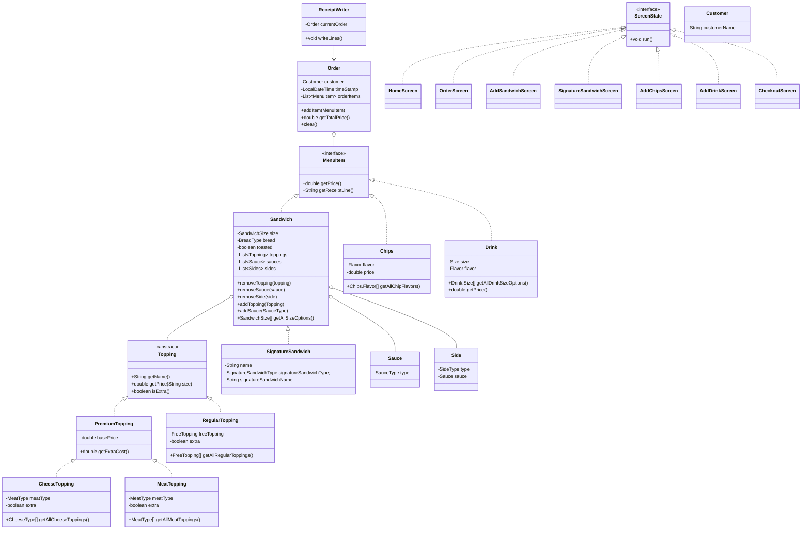

# 🥪 DELI-cious

This project is the point of sales java application for DELI-cious, a custom terminal sandwich shop.

## 🚀 Features

- 🌟 **Signature & Custom Sandwiches** — Craft your own or choose from ready-made combos.
- 🧠 **Object-Oriented Design** — Polymorphism, inheritance, and composition done right.
- 🔁 **Reusable UI Components** — Helper classes streamline input flow and state management.
- 🧪 **Testable Architecture** — Core logic decoupled from UI for unit testing.

## 🧜‍♀️ UML Architecture Overview

------------------------------
## 💡 Code Highlights
------------------------------
### 🖥️ ScreenState Interface: Navigating the UI Flow

The ScreenState interface is a central part of the application's UI navigation architecture. It provides a consistent contract for all interactive screens in the DELI-cious point-of-sale system. Every screen that the user interacts with (like selecting a sandwich, checking out, or adding a drink) implements this interface. The run() method encapsulates the logic for rendering that screen and handling user input, which promotes a clean separation of concerns and ensures consistent control flow across the application.

```
public interface ScreenState {
    void display();
    ScreenState handleInput(Scanner scanner, Order currentOrder);
}
```

* Benefits *

- Modular Design: Each screen is self-contained and easy to maintain or extend.

- Scalable Navigation: Adding a new screen is as simple as implementing the interface.

- Testability: Individual screens can be tested independently by invoking their run() method with mocked input.

- Decoupling: UI flow management is separated from the business logic, making the codebase more manageable.

```
public class OrderScreen implements ScreenState {
    @Override
    public void display() {
        ClearScreen.clearScreen();
        PrintColored.printColored("😋========= Place an Order ========😋", "magenta");
    }

    public ScreenState handleInput(Scanner scanner, Order currentOrder) {
        String[] options = {"1) Add Sandwich", "2) Add Drink", "3) Add Chips", "4) Checkout", "0) Cancel " +
                "Order"};
        for (String option : options) {
            System.out.println("\t" + option);
        }
        int input = scanner.nextInt();
        return switch (input) {
            case 0 -> {
                currentOrder.clear();
                yield new OrderScreen();
            }
            case 1 -> new AddSandwichScreen();
            case 2 -> new AddDrinkScreen();
            case 3 -> new AddChipsScreen();
            case 4 -> new CheckoutScreen();
            default -> {
                PrintColored.printColored("Invalid input. Try again", "red");
                yield this;
            }
        };
    }
}
```

* Screens That Implement ScreenState *

- HomeScreen

- OrderScreen

- AddSandwichScreen

- SignatureSandwichScreen

- AddChipsScreen

- AddDrinkScreen

- CheckoutScreen

➡️ Highlight: The ScreenState interface enables a plug-and-play architecture for user interactions, which is both intuitive for developers and robust under real-world use.

----------------

### 🥪 SignatureSandwich Inheritance from Sandwich

In the DELI-cious point-of-sale system, not all sandwiches are built from scratch. Some are pre-designed and popular choices—these are our Signature Sandwiches. To represent these, we introduce the SignatureSandwich class, which extends the more general Sandwich superclass.

The SignatureSandwich inherits all the core capabilities of a Sandwich, including:
- size, bread, toasted status
- Lists of Topping, Sauce, and Side
- Methods like addTopping(), addSauce(), removeTopping(), etc.

This inheritance ensures that a signature sandwich can participate in all system flows and behave like any other Sandwich object—with the added benefit of having predefined settings.
- signatureSandwichType: Enum identifying the preset sandwich category (e.g., CLUB, BLT, VEGGIE).
- signatureSandwichName: Human-readable name for the sandwich.
- Optional override behavior or constraints—for example, preventing users from changing ingredients unless explicitly allowed.

🧠 Why This Matters
Using inheritance allows the system to:
- Reuse behavior: No need to re-implement topping/sauce/side logic.
- Differentiate meaningfully: Signature sandwiches are conceptually different from custom builds, and this distinction is cleanly represented in the class hierarchy.
- Extend easily: New signature sandwiches can be introduced with minimal changes to core logic.

➡️ Highlight: SignatureSandwich elegantly balances customization and standardization, offering users speed and familiarity while keeping the backend design robust and DRY.

----------------------------------

### 🥑 Toppings 

```
public abstract class Topping {
    protected String name;
    public String getName() { return name; }
    public abstract double getPrice(Sandwich.SandwichSize sizeInInches);
}

public abstract class PremiumTopping extends Topping {
    protected double basePrice;

    public abstract double getPrice(Sandwich.SandwichSize sandwichSize);

    protected abstract double getExtraCost(Sandwich.SandwichSize sandwichSize);
}


```
➡️ Highlight: Decouples business logic from concrete implementations like MeatTopping/CheeseTopping in the case of the abstract class PremiumTopping, or RegularTopping in the case of Topping.

-----------------------------

### 🧀🍅🍞 SandwichBuilderHelper

```
    public static void chooseMeat(Scanner scanner, Sandwich sandwich) {
        ClearScreen.clearScreen();
        MeatTopping.MeatType[] meatOptions = MeatTopping.getAllMeatOptions();
        PrintColored.printColored("Select meat:", "yellow");
        for (int i = 0; i <= meatOptions.length - 1; i++) {
            System.out.printf("\t%d) %s\n", i + 1, meatOptions[i].getValue());
        }
        int choice = handleInput(scanner, meatOptions.length);
        System.out.printf("Extra %s?\t1) Yes\t2) No\n", meatOptions[choice - 1].getValue());
        int extra;
        do {
            extra = scanner.nextInt();
            if (extra == 1) {
                sandwich.addTopping(new MeatTopping(meatOptions[choice - 1], true));
            } else if (extra == 2) {
                sandwich.addTopping(new MeatTopping(meatOptions[choice - 1], false));
            } else {
                PrintColored.printColored("Invalid choice, please try again.", "red");
            }
        } while (extra != 1 && extra != 2);
    }
```

➡️ Highlight: Clean iteration, dynamic choice handling, and extensibility (e.g., supports any future topping types).

---------------------

### 🥬🫑🥒 Enums
Enums are a key part of the design, ensuring that only valid, expected options are allowed for ingredients, sides, and configurations. This avoids the need for fragile string comparisons and provides type-safe access to UI display values and logic branching.

```
public enum FreeTopping {
        LETTUCE("Lettuce"),
        PEPPERS("Peppers"),
        ONIONS("Onions"),
        TOMATOES("Tomatoes"),
        JALAPENOS("Jalapeños"),
        CUCUMBERS("Cucumbers"),
        PICKLES("Pickles"),
        GUACAMOLE("Guacamole"),
        MUSHROOMS("Mushrooms");

        private final String toppingName;

        FreeTopping(String toppingName) {
            this.toppingName = toppingName;
        }

        public String getValue() {
            return toppingName;
        }
    }
```

* 🧀 Other Enums *

CheeseType — All available cheese options (e.g., Cheddar, Swiss)

- MeatType — All available cheese options (e.g., Cheddar, Swiss)

- SauceType — Condiments and sauces (e.g., Mayo, Mustard, Ketchup)

- SideType - Au Jus or Sauce

- SignatureSandwichType — Maps names to default sandwich builds

- BreadType, SandwichSize — Core configuration choices

- Chips.Flavor, Drink.Size, Drink.Flavor — Side item variations

➡️ Highlight: The use of enums enhances user input validation, simplifies menu rendering, and keeps the codebase maintainable.

----------------------------

### 🧪 Testing Support

The business logic (e.g., ingredient management, sandwich configuration) is fully testable with JUnit. 


A large portion of the app has been protected from crashing with invalid inputs (i.e. a letter instead of an int)

-------------------------

## User Story Screenshots

### Creating an Order


### Ordering Sandwiches


* Signature Sandwich *


### Ordering a Drink and Chips


### Checking Out and Printing Receipt to TXT File


