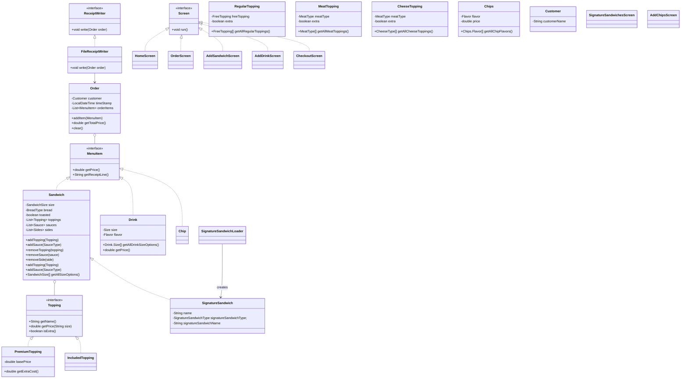

# deli-cious
This project is the point of sales java application for DELI-cious, a custom sandwich shop.

```mermaid
classDiagram
    %% Interfaces
    class Topping {
        <<interface>>
        +String getName()
        +double getPrice(String size)
        +boolean isExtra()
    }

    class MenuItem {
        <<interface>>
        +double getPrice()
        +String getReceiptLine()
    }

    class Screen {
        <<interface>>
        +void run()
    }

    class ReceiptWriter {
        <<interface>>
        +void write(Order order)
    }

    %% Concrete Classes
    class Sandwich {
        -SandwichSize size
        -BreadType bread
        -boolean toasted
        -List~Topping~ toppings
        -List~Sauce~ sauces
        -List~Sides~ sides
        +addTopping(Topping)
        +addSauce(SauceType)
        +removeTopping(topping)
        +removeSauce(sauce)
        +removeSide(side)
        +addTopping(Topping)
        +addSauce(SauceType)
        +SandwichSize[] getAllSizeOptions()
    }

    class SignatureSandwich{
        -String name
        -SignatureSandwichType signatureSandwichType;
        -String signatureSandwichName
    }

    class PremiumTopping {
        -double basePrice
        +double getExtraCost()
    }

    class RegularTopping {
        -FreeTopping freeTopping
        -boolean extra
        +FreeTopping[] getAllRegularToppings()
    }

    class MeatTopping {
        -MeatType meatType
        -boolean extra
        +MeatType[] getAllMeatToppings()
    }

    class CheeseTopping {
        -MeatType meatType
        -boolean extra
        +CheeseType[] getAllCheeseToppings()
    }

    class Chips {
        -Flavor flavor
        -double price
        +Chips.Flavor[] getAllChipFlavors()
    }

    class Drink {
        -Size size
        -Flavor flavor
        +Drink.Size[] getAllDrinkSizeOptions() 
        +double getPrice()
    }

    class Order {
        -Customer customer
        -LocalDateTime timeStamp
        -List~MenuItem~ orderItems
        +addItem(MenuItem)
        +double getTotalPrice()
        +clear()
    }

    class Customer {
        -String customerName
    }

    class FileReceiptWriter {
        +void write(Order order)
    }

    %% Screen Classes
    class HomeScreen
    class OrderScreen
    class AddSandwichScreen
    class SignatureSandwichesScreen
    class AddChipsScreen
    class AddDrinkScreen
    class CheckoutScreen

    %% Relationships
    Topping <|.. PremiumTopping
    Topping <|.. IncludedTopping

    MenuItem <|.. Sandwich
    MenuItem <|.. Chip
    MenuItem <|.. Drink

    Sandwich <|.. SignatureSandwich
    SignatureSandwichLoader --> SignatureSandwich : creates
    Sandwich o-- Topping
    Order o-- MenuItem

    Screen <|.. HomeScreen
    Screen <|.. OrderScreen
    Screen <|.. AddSandwichScreen
    Screen <|.. AddDrinkScreen
    Screen <|.. CheckoutScreen

    ReceiptWriter <|.. FileReceiptWriter
    FileReceiptWriter --> Order
```
